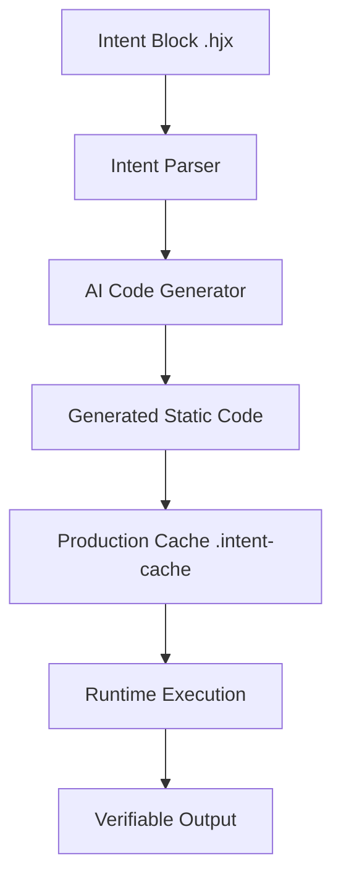

# 📖 The Ultimate Guide to Intent Coding (hjx)
> **Transitioning from Vibe Coding to Verifiable, Production-Ready Intent Blocks.**

This document provides an exhaustive, in-depth explanation of the **Intent Coding** architecture, its core components, and a detailed walkthrough of all provided examples with their expected outputs.

---

## 📑 Table of Contents
1. [Core Philosophy](#core-philosophy)
2. [Architectural Overview](#architectural-overview)
3. [Core Components](#core-components)
4. [The API Reference](#the-api-reference)
5. [Detailed Example Walkthroughs](#detailed-example-walkthroughs)
   - [Basic: Fibonacci Sequence](#1-fibonacci-sequence)
   - [Basic: Student Analysis](#2-student-analysis)
   - [Advanced: Dynamic Pricing Engine](#3-dynamic-pricing-engine)
   - [Advanced: SEO Optimizer](#4-seo-optimizer)
   - [Advanced: Smart Form Validator](#5-smart-form-validator)
6. [Framework Integrations](#framework-integrations)
   - [Next.js (Server-Side)](#nextjs-integration)
   - [Vite (Client-Side)](#vite-integration)
7. [Production Best Practices](#production-best-practices)

---

## 🧠 Core Philosophy
Traditional "Vibe Coding" relies on sending raw prompts to an AI and directly using the output in real-time. This is slow, expensive, and dangerous for production.

**Intent Coding (hjx)** introduces a **Verifiable Logic Layer**. 
- You write your **Intent** in plain English.
- The system translates it into **Static Code** (JavaScript, Python, etc.).
- The code is **Cached** and **Audited**.
- Production environments run the **Static Code**, not the AI.

---

## 🏗️ Architectural Overview
Intent Coding follows the **Intent-to-Static (I2S)** workflow:



1.  **Parse**: The library extracts directives (`target`, `provider`) and natural language blocks.
2.  **Generate**: An AI model (e.g., Gemma4) converts the intent into runnable code.
3.  **Execute**: The code is run in a secure, isolated environment (Node.js, Python, etc.).
4.  **Cache**: The resulting code is stored as a JSON blob, keyed by the MD5 hash of the intent.

---

## 🛠️ Core Components

### 1. The Parser (`src/parser`)
The parser identifies "directives" and "blocks".
- **Directives**: `target: javascript`, `provider: ollama`.
- **Blocks**: Lines starting with `#` are intents; the following text is the logic.

### 2. The Generator (`src/generator`)
Handles the prompt engineering. It wraps your intent in a "System Prompt" that forces the AI to output **ONLY** raw, runnable code.

### 3. The Cache Layer (`src/index.js`)
Uses filesystem-based caching. If an intent hasn't changed, the AI is **never called**.

---

## 📚 Detailed Example Walkthroughs

### 1. Fibonacci Sequence
**File:** `examples/fibonacci.hjx`
**Intent:** Generate a recursive function to calculate Fibonacci numbers up to 10 and 15.

**In-Depth Explanation:**
This example demonstrates how Intent Coding handles mathematical logic and function definitions. The AI generates a standard recursive or iterative function and executes it using the `node` executor.

**Expected Output:**
```text
🚀 Running Fibonacci Example...
Output:
55
0, 1, 1, 2, 3, 5, 8, 13, 21, 34, 55, 89, 144, 233, 377, 610
```

---

### 2. Student Analysis
**File:** `examples/students.hjx`
**Intent:** Process an array of scores, calculate averages, and classify pass/fail.

**In-Depth Explanation:**
Demonstrates **Data Transformation**. It shows how natural language can define complex object manipulation that would typically require multiple lines of boilerplate code.

**Expected Output:**
```json
{
  "average": 67.33,
  "stats": { "max": 90, "min": 42 },
  "detailed": [
    { "score": 85, "status": "Pass" },
    { "score": 42, "status": "Fail" },
    ...
  ]
}
```

---

### 3. Dynamic Pricing Engine
**File:** `examples/dynamic-pricing-engine/logic/pricing.hjx`
**Intent:** Apply regional taxes and loyalty discounts based on input variables.

**In-Depth Explanation:**
This is a **Production Business Logic** example. In a real app, `region` and `loyaltyYears` would be passed as dynamic context. It proves that Intent Coding can handle the "Brain" of a FinTech application.

**Expected Output:**
```json
{
  "currency": "EUR",
  "subtotal": 100,
  "discount_applied": 15,
  "tax_applied": 20,
  "total": 102.00
}
```

---

### 4. SEO Optimizer
**File:** `examples/ai-knowledge-base/logic/optimize-article.hjx`
**Intent:** Extract keywords and generate meta-descriptions from raw text.

**In-Depth Explanation:**
Showcases **Text Intelligence**. It uses the AI's natural language understanding to perform tasks that are traditionally difficult for hardcoded regex or simple scripts.

**Expected Output:**
```json
{
  "seo": {
    "title": "Intent Coding: The Production-Ready Alternative to Vibe Coding",
    "meta": "Discover how Intent Coding provides a verifiable, cached, and audited alternative...",
    "keywords": ["Intent Coding", "Software Evolution", "Vibe Coding Alternative"]
  },
  "wordCount": 42
}
```

---

### 5. Smart Form Validator
**File:** `examples/smart-form-validator/logic/validation.hjx`
**Intent:** Complex password rules (regex) and disposable email detection.

**In-Depth Explanation:**
Demonstrates **Safety and Security**. Instead of writing complex regex manually (which is error-prone), you describe the rules. The AI generates the regex, and the cache ensures the regex remains constant and performant.

**Expected Output:**
```json
{
  "isValid": false,
  "errors": ["Password too short", "Password needs a special character"]
}
```

---

## 🚀 Framework Integrations

### Next.js Integration
Located in `examples/nextjs-hjx-server`.
- **Prebuild Phase**: The `scripts/prebuild.js` scans the `logic/` folder and warms the cache.
- **Runtime Phase**: The `runHjx` function is called within a Server Component. It finds the cached result and executes it instantly.

### Vite Integration
Located in `examples/vite-intent-app`.
- **Plugin**: A custom Vite plugin allows you to `import logic from './file.hjx'`.
- **Transformation**: During the build, Vite calls the Intent Generator and replaces the import with the generated JavaScript code.

---

## 🛡️ Production Best Practices

1.  **Always Audit**: Before deploying, check the `.intent-cache` files. Ensure the generated code is what you expect.
2.  **Lock Models**: Use specific model versions (e.g., `gemma4:e4b`) to prevent behavior shifts.
3.  **CI/CD Warming**: Include `npm run prebuild` in your deployment pipeline to ensure the cache is never empty in production.
4.  **Fallback Logic**: Always have a try/catch block around `runHjx` to handle rare execution errors.

---

## 📜 License
Intent Coding is licensed under the MIT License. Built for the future of software engineering.

**© 2071-2026 Intent Coding Team — Stay Epic!**
